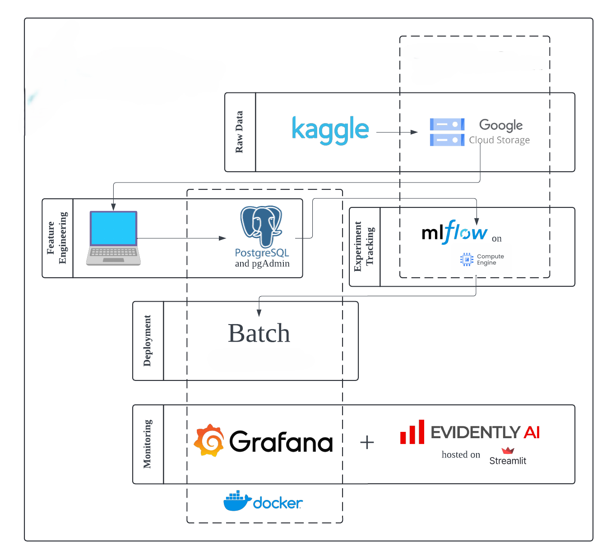

# In-Hospital Mortality Prediction

## Description
This project aims to develop an end-to-end machine learning pipeline for predicting in-hospital mortality using various tools and technologies, including MLflow, Mage, Docker, Google Cloud, Evidently AI, Grafana, and more. The goal is to build a reliable and scalable system for monitoring and predicting patient outcomes based on medical data.

### Problem
The primary objective is to predict the likelihood of in-hospital mortality for patients based on their medical records and clinical data. Early prediction can help healthcare providers take necessary actions to improve patient outcomes and allocate resources effectively.

### Objective
Develop and deploy a machine learning model to predict in-hospital mortality.
Implement a robust and scalable MLOps pipeline for continuous integration and delivery.
Monitor model performance and ensure accuracy over time.

### Dataset
The dataset used for this project is named "In-Hospital-Mortality-Prediction." It consists of medical records and clinical data for patients. The target column is outcome, which indicates whether the patient survived or not.

## Columns and Their Descriptions
1. patient_id: Unique identifier for each patient.
2. age: Age of the patient.
3. gender: Gender of the patient (e.g., Male, Female).
4. admission_type: Type of hospital admission (e.g., Emergency, Elective).
5. diagnosis: Primary diagnosis for the patient.
6. comorbidities: List of comorbid conditions.
7. length_of_stay: Duration of the hospital stay (in days).
8. icu_admission: Whether the patient was admitted to the ICU (Yes/No).
9. ventilation: Whether the patient required mechanical ventilation (Yes/No).
10. heart_rate: Heart rate of the patient at admission.
11. blood_pressure: Blood pressure of the patient at admission.
12. respiratory_rate: Respiratory rate of the patient at admission.
13. temperature: Body temperature of the patient at admission.
14. outcome: Target variable indicating the outcome (0 for survived, 1 for mortality).

## Tools & Technologies
- Cloud: Google Cloud SDK
- Virtual Machine: Google Compute Engine
- Containerization: Docker and Docker Compose
- Orchestration: Mage
- Experiment Tracking and Model Management: MLflow
- Model Artifacts Storage: Google Cloud Storage
- Streaming Model Deployment: Google Cloud Functions
- Container Storage: Google Container Registry
- Model Monitoring: Evidently AI and Grafana
- Language: Python

### Architecture
The architecture of the project is designed to ensure seamless integration and automation of various components, from data ingestion to model deployment and monitoring. The diagram below illustrates the overall architecture:

### Exploratory Data Analysis and Modeling
The exploratory data analysis and modeling is done in the notebooks directory. The exploratory data analysis is done in the analysis.ipynb notebook. The modeling is done in the modeling.ipynb notebook.

### Setup
WARNING: You will be charged for all the infra setup. You can try free trials or 12 months free tier on Google Cloud.
