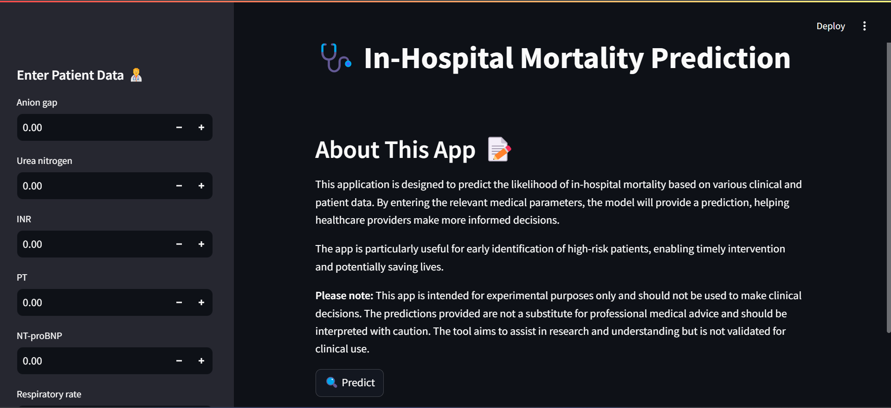

# Predicting In-Hospital Mortality 🩺

Hey there! 👋 Welcome to my machine learning project, where I’m working on something super important—predicting in-hospital mortality. The whole idea is to create a reproducible pipeline, so whether you’re running it on your laptop or in the cloud, you can easily follow along and get the same results. ✨

I’ve pulled together medical data and built an end to end machine learning project. To make it all happen, I’m using tools like MLflow, Mage, Docker, Google Cloud, Evidently AI, Grafana etc. 

The goal? Make sure everything is running smoothly, scalable, and—most importantly—reproducible. Ultimately, it’s about giving healthcare professionals the insights they need to help their patients in the best possible way.

## 📝 Problem Description

Hospital mortality are pressing challenges in healthcare today. The ability to predict in-hospital mortality can be crucial for better patient management and improving outcomes.

### Objective

The objective of this project is to develop a machine learning model that can accurately predict the likelihood of a patient’s mortality during their hospital stay. The goal is to provide healthcare professionals with valuable insights that can potentially save lives.

### Dataset

The dataset I used for this project comes from the [Kaggle In-Hospital Mortality Prediction dataset](https://www.kaggle.com/datasets/saurabhshahane/in-hospital-mortality-prediction), which provides a comprehensive collection of ICU patient data, including physiological measurements and clinical information.

- **Number of records**: 1,178 ICU stays
- **Original number of features**: 51 columns  
- **Reduced number of features**: 24 columns

To simplify the task and focus on the most relevant clinical features, I reduced the dataset from its original 51 columns to 24 columns, stored in the `data/processed_data.csv` file. This allows for a more efficient model-building process while maintaining accuracy.

For more detailed information about the dataset, including explanations of the columns, please refer to the [`data/README.md`](data/README.md).


## Tools & Technologies
- **Cloud Platform:** [Google Cloud Platform (GCP)](https://cloud.google.com/)
- **Container Registry:** [Google Container Registry (GCR)](https://cloud.google.com/container-registry)
- **Containerization:** [Docker](https://www.docker.com/) and [Docker Compose](https://docs.docker.com/compose/)
- **Orchestration:** [Google Cloud Run](https://cloud.google.com/run)
- **Continuous Integration/Continuous Deployment (CI/CD):** [GitHub Actions](https://github.com/features/actions)
- **Pipeline Development:** [Mage](https://mage.ai/) (local pipeline orchestration)
- **Experiment Tracking and Model Management:** [MLflow](https://mlflow.org/) (local experiment tracking and model management)
- **Model Artifacts Storage:** [Google Cloud Storage](https://cloud.google.com/storage)
- **Model Monitoring:** [Evidently AI](https://evidently.ai/) and [Grafana](https://grafana.com/)
- **Language:** [Python](https://www.python.org/)
- **Web Application Framework (Local Deployment):** [Flask](https://flask.palletsprojects.com/en/2.2.x/) (for local web deployment)
- **Web Application Framework (Cloud Deployment):** [Streamlit](https://streamlit.io/) (for cloud-based web deployment)


**Warning:** Following the steps of what's in here may cost you money (Google Cloud is a paid service), be sure to shut down any Google Cloud service you no longer need to use to avoid charges.

## 🎉 Live Streamlit App

You can check out the live version of the Streamlit app at the following URL:

[Streamlit App](https://streamlit-app-brrxtoum2a-uc.a.run.app/)

### 📸 Screenshot of the App



### Exploratory Data Analysis and Modeling 

The exploratory data analysis and modeling are done in the [notebooks directory](notebook/). The exploratory data analysis and baseline model building are done in the `analysis.ipynb` notebook. The `experiment.ipynb` is where I practiced the experiment tracking before I integrated it with the mage pipeline. The notebook directory also contains a model directory called `model`, where the baseline model is stored.

## Setup
**Warning (again):** Using Google Cloud services costs money. If you don't have credits (you get $300USD when you first sign up), you will be charged. Delete and shutdown your work when finished to avoid charges.

### 📋 Prerequisites

Before setting up the project, ensure you have completed the following prerequisites. Detailed, step-by-step instructions for each prerequisite can be found in their respective files located in the `setup` folder.

1. **Google Cloud Platform (GCP) Account**: An active GCP account to use Google Cloud services. [See the detailed guide](./setup/setup_gcp_account.md) for instructions.
   
2. **Docker**: Install Docker and Docker Compose for containerization and local development. [See the detailed guide](./setup/setup_docker.md) for instructions.

3. **Python**: Make sure you have Python installed (Python 3.12 recommended). [See the detailed guide](./setup/setup_python.md) for instructions.

4. **Google Cloud SDK**: Install Google Cloud SDK for managing Google Cloud resources. [See the detailed guide](./setup/setup_gcloud_sdk.md) for instructions.

5. **GitHub Account**: For CI/CD pipelines using GitHub Actions. [See the detailed guide](./setup/setup_github_account.md) for instructions.

### ✨ Setup

#### **Local Setup**

#### **Clone the Repository**:

   ```bash
   git clone https://github.com/Tobai24/In-Hospital-Mortality-Prediction.git
   cd In-Hospital-Mortality-Prediction
   ```

#### **Set Up the Python Environment**:

   **Option 1: Using `pipenv`** (Recommended)
   - Install pipenv
      ```bash
      pip install pipenv
      ```

   - Install the dependencies with `pipenv`:

     ```bash
     pipenv install
     ```

   - Activate the `pipenv` shell:

     ```bash
     pipenv shell
     ```

   **Option 2: Using `requirements.txt`** (For users preferring `pip`)

   - Create and activate a virtual environment:

     ```bash
     python -m venv venv
     source venv/bin/activate  # On Windows use: venv\Scripts\activate
     ```

   - Install the dependencies:

     ```bash
     pip install -r requirements.txt
     ```

---

### 📝 Notes:

- If you use `pipenv`, you do not need to install the `requirements.txt` dependencies manually because `pipenv` reads the `Pipfile` and manages the environment for you.


## Get Going

Ready to dive into your project? Here’s a quick guide to get you started. Each step is broken down into folders, so you’ll find all the info you need right where you need it.

### 📁 **Workflow**

- **Tools Used**: Mage for pipelines and MLflow for experiment tracking.
- **Where to Find It**: Check out the [workflow](workflow) folder in your project directory. The README in this directory will walk you through setting up Mage and MLflow for this project. 

### 📁 **Deployment**

### **Local Deployment**

- **Tools Used**: Flask for building your web app and Docker for containerizing it.
- **Where to Find It**: Head over to the [deployment/local_deployment](deployment/local_deployment) folder. This README covers everything you need to get your app running locally. It’s got the details for setting up Flask and Docker, so you can test things out on your own machine.

### **Cloud Deployment**

- **Tools Used**: Google Cloud Platform (GCP) for hosting your app and Streamlit for the web interface.
- **Where to Find It**: Navigate to the [deployment/web_deployment](deployment/web_deployment) folder. The README guides you through deploying your app to GCP using Streamlit. It’s perfect for getting your app live on the cloud.

It also include steps to for continuous deployment with gitHub Actions

### 📁 **Monitoring**

- **Tools Used**: Grafana for creating dashboards and Evidently AI for monitoring your models.
- **Where to Find It**: You’ll find this info in the [monitoring](monitoring) folder. This README will show you how to set up Grafana and Evidently AI to keep an eye on your app’s performance and metrics.

Feel free to explore these folders and read through the instructions. Each README is packed with the details you need to get everything up and running smoothly. Enjoy setting up your project! 🚀

## 🎉 Special Mentions

A huge thank you to [DataTalks.Club](https://datatalks.club) for offering their MLOps course for free! 🌟 The insights and skills I gained from their course were crucial in developing this project. If you want to enhance your expertise in MLOps, I highly recommend checking out their [course](https://github.com/DataTalksClub/mlops-zoomcamp). It’s an invaluable resource for diving into MLOps technologies! 📚✨


