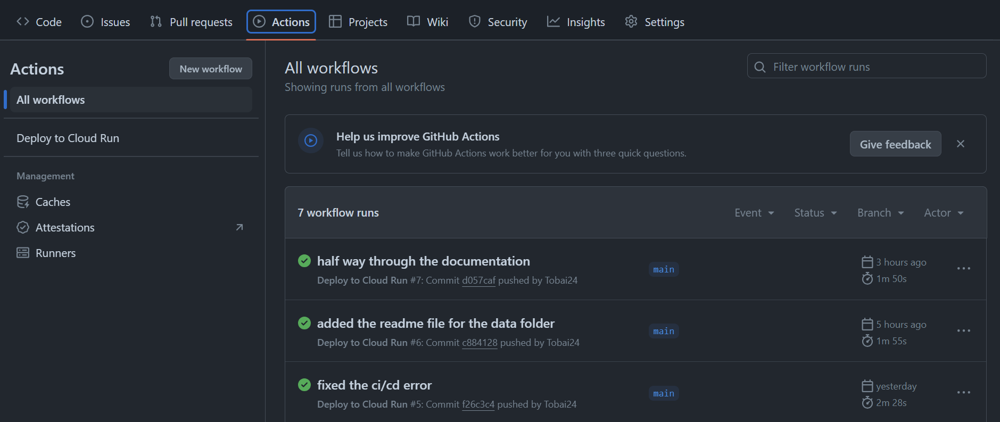

# Deploy Your Streamlit App Locally and to Google Cloud Run Using Docker ✨

Ready to get your Streamlit app up and running? Let’s get started with containerizing your app with Docker, testing it locally, and deploying it to Google Cloud Run. I’ll walk you through each step!

### Table of Contents
1. [Run Your App Locally with Docker](#run-your-app-locally-with-docker)
2. [Set Up Google Cloud Platform](#set-up-google-cloud-platform)
3. [Tag and Push Docker Image to Google Cloud](#tag-and-push-docker-image-to-google-cloud)
4. [Deploy to Google Cloud Run](#deploy-to-google-cloud-run)
5. [Access and Monitor Your App](#access-and-monitor-your-app)
6. [Updating and Scaling](#updating-and-scaling)
7. [Continuous Deployment with GitHub Actions](#continuous-deployment-with-github-actions)

## **Run Your App Locally with Docker**

Let’s start by getting your Streamlit app up and running on your local machine.

Before we go on pls edit the Dockerfile to this, it won't be in this format because I used the same docker file for the continous deployment. Check this for more details - [Continuous Deployment with GitHub Actions](#continuous-deployment-with-github-actions)

```bash
  FROM python:3.12-slim


  WORKDIR /app

  COPY requirements.txt ./

  RUN pip install --no-cache-dir -r requirements.txt

  COPY app.py model.pkl ./

  EXPOSE 8501

  CMD ["streamlit", "run", "app.py"]
```

1. **Build the Docker Image:**
   - Navigate to the `deployment/web_deployment` directory in your terminal:
     ```bash
     cd deployment/web_deployment
     ```

   - Build your Docker image using the following command:
     ```bash
     docker build -t streamlit-app:latest .
     ```

2. **Run the Docker Container Locally:**
   - After building the image, run your Streamlit app in a Docker container:
     ```bash
     docker run -p 8501:8501 streamlit-app:latest
     ```
   - Open your browser and navigate to `http://localhost:8501` to see your app in action.

  

## **Set Up Google Cloud Platform**

Now, let’s prepare your Google Cloud environment to deploy your app.

1. **Create a Google Cloud Account and Project:**
   - Sign in to [Google Cloud Console](https://console.cloud.google.com/), and create a new project. Note down the **Project ID**.

2. **Enable Cloud Run and Cloud Build APIs:**
   - Go to **APIs & Services** > **Library** and enable both **Cloud Run** and **Cloud Build** for your project.

3. **Install Google Cloud SDK:**
   - Install the Google Cloud SDK on your machine:
     ```bash
     curl https://sdk.cloud.google.com | bash
     exec -l $SHELL
     gcloud init
     ```
   - Authenticate and set up your project with the `gcloud init` command.

## **Tag and Push Docker Image to Google Cloud**

Let’s get your Docker image ready for Google Cloud.

1. **Authenticate Docker with Google Cloud:**
   - Run the following command to configure Docker for Google Cloud:
     ```bash
     gcloud auth configure-docker
     ```

2. **Tag the Docker Image:**
   - Tag your image for Google Container Registry:
     ```bash
     docker tag streamlit-app:latest gcr.io/<your-project-id>/streamlit-app:latest
     ```
   - Replace `<your-project-id>` with your actual Google Cloud project ID.

3. **Push the Docker Image:**
   - Push the tagged image to Google Container Registry:
     ```bash
     docker push gcr.io/<your-project-id>/streamlit-app:latest
     ```

## **Deploy to Google Cloud Run**

With your image pushed, it’s time to deploy it.

1. **Deploy the App:**
   - Use the following command to deploy your app:
     ```bash
     gcloud run deploy streamlit-app \
       --image gcr.io/<your-project-id>/streamlit-app:latest \
       --platform managed \
       --region <your-region> \
       --allow-unauthenticated
     ```
   - Replace `<your-project-id>` and `<your-region>` (e.g., `us-central1`) with your actual values.

2. **Wait for Deployment:**
   - Google Cloud Run will deploy your app and provide a URL where you can access it once the deployment is complete.

## **Access and Monitor Your App**

Let’s check that your app is live and monitor its performance.

1. **Access the App:**
   - Open the URL provided by Cloud Run to access your deployed app (e.g., `https://<your-app-url>`).

2. **Monitor Performance:**
   - Use **Google Cloud Monitoring** and **Logging** tools to keep track of app performance and logs.

## **Updating and Scaling**

Keep your app up-to-date and scalable.

1. **Update Your App:**
   - Make changes to your app, rebuild the Docker image, push it to Google Container Registry, and redeploy using the same `gcloud run deploy` command.

2. **Auto-Scaling:**
   - Google Cloud Run automatically scales based on traffic. No manual intervention needed.

## **Continuous Deployment with GitHub Actions**

Automate updates to your app with GitHub Actions.

### **Enable Required Google Cloud APIs:**
   - Ensure the following APIs are enabled:
     - Cloud Build API
     - Cloud Run API
     - Container Registry API

### **Create a Service Account**
   - In the left-hand navigation menu, go to **IAM & Admin** > **Service Accounts**.
   - Click the **Create Service Account** button at the top.
   
   **Service Account Details:**
   - **Service account name**: Enter a name that describes the service account (e.g., `my-service-account`).
   - **Service account ID**: This will auto-fill based on the name you choose. You can edit it if needed.
   - **Service account description**: Optionally, provide a description (e.g., `Service account for Cloud Run deployment`).
   - Click **Create and Continue**.

### **Grant Service Account Roles**
   - You will be prompted to assign roles to the service account. Add the following roles:

     1. **Cloud Run Admin**:
        - Click **Select a role** dropdown.
        - Search for **Cloud Run Admin** and select it.

     2. **Storage Admin**:
        - Click **Add Another Role**.
        - Search for **Storage Admin** and select it.

     3. **Viewer**:
        - Click **Add Another Role**.
        - Search for **Viewer** and select it.

     4. **Cloud Build Editor**:
        - Click **Add Another Role**.
        - Search for **Cloud Build Editor** and select it.

   - Once you've added all the roles, click **Continue**.

### **Grant Users Access to This Service Account**
   - You can skip this step unless you want to give other users or groups permission to use the service account.
   - Click **Done**.

### **Generate a JSON Key for the Service Account**
   - After creating the service account, you'll be redirected to the **Service Accounts** page.
   - Locate the service account you just created and click the **Actions** menu (three vertical dots) next to it.
   - Select **Manage keys**.

   **Create a Key:**
   - Click **Add Key** > **Create New Key**.
   - In the pop-up, select **JSON** as the key type.
   - Click **Create**.

   - A JSON key file will be generated and automatically downloaded to your computer. This file contains the credentials for the service account and should be securely stored.

### **Secure the JSON Key**
   - Store the JSON key in a secure location. Avoid checking it into version control or exposing it publicly. 
   - You will use this JSON key for authentication when deploying resources (e.g., Cloud Run, Cloud Build).

### **Store Secrets in GitHub:**
   - In your GitHub repository, go to **Settings** > **Secrets and Variables** > **Actions**.
   - Add the following secrets:
     - `GCP_PROJECT`: Your Google Cloud project ID.
     - `GCP_SA_KEY`: JSON key content.
     - `GCP_REGION`: Region for Cloud Run (e.g., `us-central1`).
     - `GCP_RUN_SERVICE`: Name of your Cloud Run service.

### **Setting up the docker file**
In order for the continous deployment to run you have to change the docker file in `deployment/web_deployment/`
we had to change it in order to run the streamlit locally. 

```bash
    FROM python:3.12-slim


    WORKDIR /app

    COPY deployment/web_deployment/requirements.txt ./

    RUN pip install --no-cache-dir -r requirements.txt

    COPY deployment/web_deployment/app.py deployment/web_deployment/model.pkl ./

    EXPOSE 8501

    CMD ["streamlit", "run", "app.py", "--server.port=8080", "--server.headless=true"]
```

### **Create a GitHub Actions Workflow:**
   - Create a `.github/workflows/deploy.yml` file in your GitHub repository:
     ```yaml
     name: Deploy to Cloud Run

     on:
       push:
         branches:
           - main

     jobs:
       deploy:
         runs-on: ubuntu-latest

         steps:
         - name: Checkout code
           uses: actions/checkout@v2

         - name: Set up Google Cloud SDK
           uses: google-github-actions/setup-gcloud@v0
           with:
             project_id: ${{ secrets.GCP_PROJECT }}
             service_account_key: ${{ secrets.GCP_SA_KEY }}

         - name: Configure Docker for Google Cloud
           run: gcloud auth configure-docker

         - name: Build and Push Docker image
           run: |
             docker build -t gcr.io/${{ secrets.GCP_PROJECT }}/streamlit-app -f deployment/web-deployment/Dockerfile .
             docker push gcr.io/${{ secrets.GCP_PROJECT }}/streamlit-app

         - name: Deploy to Cloud Run
           run: |
             gcloud run deploy ${{ secrets.GCP_RUN_SERVICE }} \
               --image gcr.io/${{ secrets.GCP_PROJECT }}/streamlit-app \
               --platform managed \
               --region ${{ secrets.GCP_REGION }} \
               --allow-unauthenticated
     ```

### **Test the Continuous Deployment:**
   - Push changes to the `main` branch of your GitHub repository to trigger the workflow.
   - Monitor the GitHub Actions tab for workflow status and logs. You should see something similar to the image below



With this guide, you’ll have your Streamlit app deployed locally and on Google Cloud Run, with automated updates via GitHub Actions. 🎉🚀
