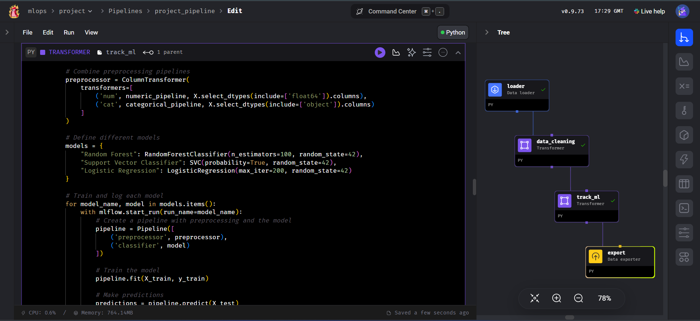
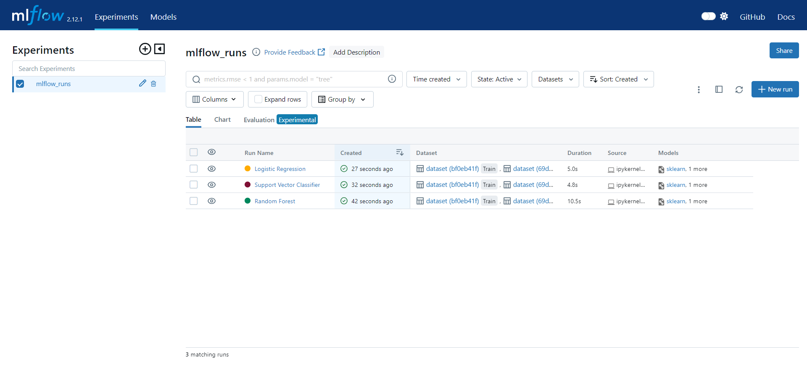

# Setup

Welcome to the workflow setup guide! 🎉 Follow these steps to get everything up and running:

1. **Navigate to Your Project Directory:**

   First, you’ll want to move into the directory where you cloned the repository:

   ```bash
   cd mlops
   ```

2. **Start Mage and the Database Service:**

   Next, launch Mage and PostgreSQL by running the following command:

   ```bash
   ./scripts/start.sh
   ```

   This command will start both MLflow and Mage, which you can then access through your web browser.

3. **Access Mage and MLflow:**

   After starting the services, open your browser and visit the following URLs:

   **Mage**: [http://localhost:6789](http://localhost:6789)  
     Here, you can view and manage your pipelines.
     When you open the mage url 
     - click on the project project then select the project_pipeline pipeline to see the pipeline
     - click on the dashboard to view the dashboard
     - click on trigger to see the trigger run setup

   **MLflow**: [http://localhost:5000](http://localhost:5000)  
     This is where you can track experiments and manage model runs.
     - click on models to see the model registry
     - click on experiments to see the performance of some of the models
     
## Mage 

   
## MLflow


   Click on the links above to explore the pipelines in Mage and the experiment tracking in MLflow.

Feel free to reach out if you have any questions or run into issues. Enjoy working with your MLOps setup! 🚀